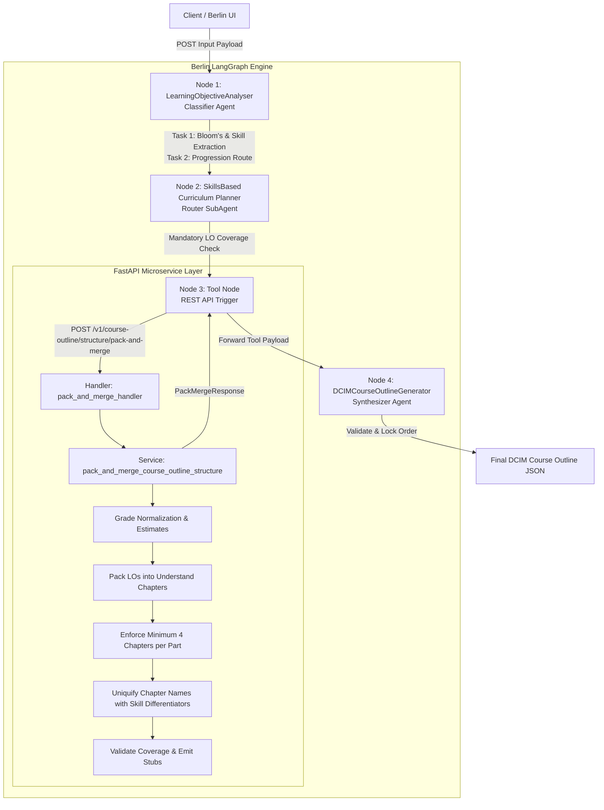
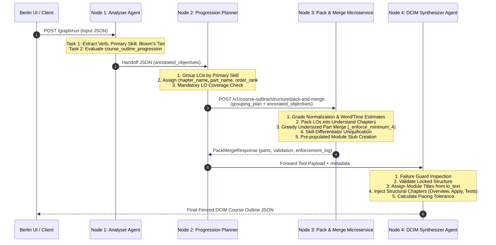
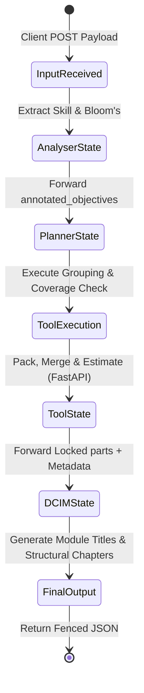

# Comprehensive Technical Documentation: K-12 AI Course Outline Generation System

> **Document Version:** 1.0.0  
> **System Architecture:** Berlin LangGraph (Router Pattern Template)  
> **Target Audience:** Engineers, Solution Architects, Technical Product Managers, AI Engineers  
> **Core LLM:** GPT-5.2 (100,000 Configured Context Limit / 400,000 Provider Max)  
> **Service Layer:** Python 3.11+ / FastAPI Deterministic Microservice (`CourseOutlinePackAndMerge`)

---

## 1. System Overview

### 1.1 System Identity & Purpose
The **K-12 Course Outline Generator AI Agent System** is an enterprise-grade curriculum intelligence engine built on Atlassian/Pearson's **Berlin LangGraph framework (PAICE Studio)**. The system transforms unstructured or semi-structured K-12 learning objectives (LOs) into fully structured, pedagogically sound, and deterministically formatted K-12 Digital Curriculum Implementation Model (DCIM) course outlines.

### 1.2 Problem Statement
Generating multi-week, multi-part K-12 course outlines directly using monolithic Large Language Models (LLMs) suffers from fundamental failure modes:
1. **Arithmetic & Pacing Hallucinations:** LLMs consistently fail at word-count summation, time-budget calculation, and lesson-day pacing constraints.
2. **Structural Drift & Part Inconsistency:** LLMs frequently generate unbalanced structures (e.g., parts with only 1 or 2 chapters, violating the K-12 pedagogical rule requiring $\ge 4$ understand chapters per content part).
3. **URN & LO Loss/Duplication:** During multi-part generation, LLMs drop, alter, or duplicate unique learning objective URNs (`learning_objective_urn`).
4. **Context Window Exhaustion:** Generating full course outlines with detailed module titles and metadata in a single prompt causes token limit overruns or degraded attention.

### 1.3 System Solution & Key Capabilities
To solve these challenges, the system implements a **hybrid Agent-Tool architecture** using a **Router-Synthesizer Pattern**:
* **LLMs handle semantic & creative reasoning:** Skill extraction, Bloom's taxonomy mapping, high-level skill domain grouping, and 2–5 word module title generation from LO text.
* **Deterministic Python logic handles math & constraints:** Word count estimations based on grade band and Bloom's level, time allocations, lesson-day packing, minimum-part enforcement ($\ge 4$ chapters via greedy adjacent merging), chapter name uniquification, and byte-for-byte URN verification.

---

## 2. Complete Architecture

### 2.1 Layered Architecture Breakdown
1. **Application / API Layer:** Exposed via FastAPI router endpoints (`/v1/course-outline/structure/pack-and-merge`) and invoked by the LangGraph Tool node using REST API calls with `PearsonExtSSOSession` authentication headers.
2. **Agent Orchestration Layer:** Berlin LangGraph engine running state transitions across 4 core graph nodes (Analyzer Classifier $\rightarrow$ Progression Planner Router SubAgent $\rightarrow$ Pack & Merge REST Tool Node $\rightarrow$ DCIM Synthesizer Node).
3. **LLM Layer:** OpenAI GPT-5.2 model instances configured with system prompts, structured JSON output constraints, and zero-temperature/low-temperature settings.
4. **Tool Layer:** Deterministic FastAPI microservice executing linear algebra, bin-packing, constraint checks, and coverage verification.
5. **Memory & State Layer:** LangGraph state passing (isolated node-to-node payload forwarding). No global shared state across non-adjacent nodes.
6. **Context-Management Layer:** Strict token budgeting (configured 100k context limit out of 400k model context), removing redundant LO text during intermediate tool calls, and forwarding pre-populated module stubs.

---

### 2.2 System Architecture Diagrams

#### High-Level Architecture Diagram (ASCII)
```
                               +--------------------------------------------------+
                               |                  User / Client                   |
                               +--------------------------------------------------+
                                                        |
                                                        v (JSON Request Payload)
+----------------------------------------------------------------------------------------------------------------+
| BERLIN LANGGRAPH ORCHESTRATOR (PAICE Studio)                                                                  |
|                                                                                                                |
|   +--------------------------------------------------------------------------------------------------------+   |
|   | NODE 1: LearningObjectiveAnalyser (Classifier Agent)                                                   |   |
|   | - Extracts verb, primary_skill, blooms_level                                                           |   |
|   | - Evaluates course_outline_progression enum                                                           |   |
|   +--------------------------------------------------------------------------------------------------------+   |
|                                                       |                                                        |
|                                                       v (Handoff: annotated_objectives)                        |
|   +--------------------------------------------------------------------------------------------------------+   |
|   | NODE 2: Curriculum Progression Planner (Router SubAgent)                                              |   |
|   | (SkillsBased / ThemeBased / Chronological / StandardsDriven)                                           |   |
|   | - Groups LOs into chapter_name, part_name, order_rank                                                  |   |
|   | - Performs Mandatory LO Coverage Check (INPUT_ROWS == ASSIGNMENT_ROWS)                                 |   |
|   +--------------------------------------------------------------------------------------------------------+   |
|                                                       |                                                        |
|                                                       v (REST API Call: grouping_plan + annotated_objectives)   |
|   +--------------------------------------------------------------------------------------------------------+   |
|   | NODE 3: CourseOutlinePackAndMerge (Tool Node)                                                         |   |
|   | +--------------------------------------------------------------------------------------------------+   |   |
|   | | Deterministic FastAPI Microservice (/v1/course-outline/structure/pack-and-merge)                 |   |   |
|   | | 1. Grade Band Normalization & Estimate Calculation                                              |   |   |
|   | | 2. Lesson-Sized Understand Chapter Packing                                                       |   |   |
|   | | 3. Undersized Part Merging (_enforce_minimum_4 logic)                                            |   |   |
|   | | 4. Unique Chapter Name Differentiators                                                           |   |   |
|   | | 5. URN Coverage Validation & Pre-populated Module Stub Generation                                |   |   |
|   | +--------------------------------------------------------------------------------------------------+   |   |
|   +--------------------------------------------------------------------------------------------------------+   |
|                                                       |                                                        |
|                                                       v (Forwarded Payload: parts + annotated_objectives)       |
|   +--------------------------------------------------------------------------------------------------------+   |
|   | NODE 4: DCIMCourseOutlineGenerator (Synthesizer Agent)                                                 |   |
|   | - Failure Guard Check                                                                                  |   |
|   | - Structure Lock Enforcement (Parts, Chapters, Stubs cannot be modified)                               |   |
|   | - Generates 2-5 word noun phrase module titles from lo_text                                            |   |
|   | - Injects Structural Chapters (Course Overview, Intros, Apply, Review, Tests, Semester Exams)         |   |
|   | - Emits Final DCIM Course Outline JSON                                                                 |   |
|   +--------------------------------------------------------------------------------------------------------+   |
|                                                                                                                |
+----------------------------------------------------------------------------------------------------------------+
                                                        |
                                                        v (Final Fenced JSON)
                               +--------------------------------------------------+
                               |                  Client Response                 |
                               +--------------------------------------------------+
```

---

#### Mermaid Architecture Diagram


---

## 3. Input Data Specification

### 3.1 Input Schema & Attributes
The system accepts a single JSON request entering the `LearningObjectiveAnalyser` node.

| Attribute Field Name | Type | Status | Validation Rules / Range | Description |
| :--- | :--- | :--- | :--- | :--- |
| `learning_objectives` | `Array[Object]` | Required | $\ge 1$ item. Each item must contain `learning_objective_urn` and `objective`. | List of raw learning objectives. |
| `learning_objectives[].learning_objective_urn` | `String` | Required | Non-empty string. Unique per LO (or tracked duplicates). | Universal Resource Name identifier for the objective. |
| `learning_objectives[].objective` | `String` | Required | Non-empty string. | Natural language text of the objective. |
| `course_title` | `String` | Required | Non-empty string. | Official name of the course. |
| `grade_band` | `String` | Required | Enum or Raw: `"K-2"`, `"3-5"`, `"MS"`, `"HS"`, or raw like `"Grade 6"`. | Target K-12 educational grade band. |
| `subject_area` | `String` | Required | Non-empty string (e.g., `"Mathematics"`, `"ELA"`). | Curriculum subject discipline. |
| `minutes_per_lesson` | `Integer` | Required | Integer $> 0$. Typical range: $15–120$. | Time allocated for a single lesson day. |
| `lessons_per_week` | `Integer` | Required | Integer $> 0$. Typical range: $1–7$. | Number of instructional days per week. |
| `course_duration_weeks` | `Integer` | Required | Integer $> 0$. Typical range: $1–52$. | Total length of the course in weeks. |
| `course_outline_progression` | `String` | Required | Enum: `"SKILLS_BASED_PROGRESSION"`, `"THEME_BASED_PROGRESSION"`, `"CHRONOLOGICAL_PROGRESSION"`, `"STANDARDS_DRIVEN_PROGRESSION"`. | Dictates routing to the specific Planner node. |
| `user_prompt` | `String` | Optional | String or `null`. | Natural language feedback/overrides for regeneration. |
| `PearsonExtSSOSession` | `String` | Optional | String or `null`. | Authentication token for downstream tool API requests. |

---

## 4. Input Processing Pipeline (16-Step Lifecycle)

1. **Request Received:** JSON payload submitted via client/Berlin Studio interface.
2. **Authentication / Authorization:** `PearsonExtSSOSession` token extracted from request header/payload for REST service authorization.
3. **Input Validation:** Validation of required fields, non-empty arrays, and non-zero positive integers.
4. **Input Parsing & Normalization:** `preprocess_payload` unwraps stringified JSON if string-encoded by LangGraph template variables.
5. **Metadata Extraction:** Extraction of course parameters (`course_title`, `grade_band`, `minutes_per_lesson`, etc.).
6. **Conversation / History Retrieval:** System operates statelessly per run; prior context retrieved if `user_prompt` contains feedback instructions.
7. **Memory Retrieval:** Retrieval of prompt guidelines, grade word limits, and Bloom's verb taxonomy tables.
8. **Context Construction (Node 1):** `LearningObjectiveAnalyser` system prompt combined with input payload.
9. **Agent Selection (Routing):** `course_outline_progression` enum mapped to `SkillsBasedCurriculumProgressionPlanner`.
10. **Agent Execution (Node 2):** Planner node executes skill consolidation and assigns `chapter_name`, `part_name`, `order_rank`.
11. **Tool Execution (Node 3):** FastAPI REST API `POST /v1/course-outline/structure/pack-and-merge` invoked with `grouping_plan` and `annotated_objectives`.
12. **Deterministic Processing:** Python microservice executes bin-packing, part merging, estimate generation, and URN validation.
13. **LLM Invocation (Node 4):** `DCIMCourseOutlineGenerator` invoked with locked `parts` structure and pre-populated stubs.
14. **Response Processing:** DCIM agent synthesizes module titles, injects structural chapters, and calculates pacing tolerances.
15. **Memory / Audit Update:** `enforcement_log` and `validation` summary attached to output.
16. **Final Response Generation:** Complete triple-backtick fenced JSON object emitted.

---

## 5. Complete Agent Inventory

### 5.1 Node 1: LearningObjectiveAnalyser
* **Agent Type:** Classifier / Preprocessor.
* **Purpose:** Annotate raw LOs with pedagogical metadata and select the downstream planner route.
* **Responsibilities:**
  1. Extract `verb` (action verb).
  2. Extract `primary_skill` (2–4 word Title Case noun phrase).
  3. Determine `blooms_level` (`Foundational`, `Intermediate`, `Advanced`).
  4. Route to specific planner based on `course_outline_progression`.
* **Input Schema:** `AnnotatedObjectivesPayload` (Raw LOs + course metadata).
* **Output Schema:** `annotated_objectives` JSON object forwarding annotated array and unmodified course metadata.

---

### 5.2 Node 2: Progression Planner (e.g., SkillsBasedCurriculumProgressionPlanner)
* **Agent Type:** Router / SubAgent.
* **Purpose:** Pedagogical grouping of LOs into logical skill domains and lesson chapters.
* **Responsibilities:**
  1. Group LOs with shared `primary_skill` into chapters.
  2. Group related chapters into parts ($\approx 4–8$ chapters per part).
  3. Assign `order_rank` within parts based on prerequisite ordering (Foundational $\rightarrow$ Intermediate $\rightarrow$ Advanced).
  4. Perform **Mandatory LO Coverage Check** (`INPUT_ROWS == ASSIGNMENT_ROWS`).
  5. Invoke `CourseOutlinePackAndMerge` REST API tool exactly once.
* **Input Schema:** `annotated_objectives` object from Analyser.
* **Output Schema:** Intermediate `grouping_plan` sent as tool input argument, then forwards the successful tool response.

---

### 5.3 Node 4: DCIMCourseOutlineGenerator
* **Agent Type:** Synthesizer / Final Assembler.
* **Purpose:** Generate the authoritative K-12 DCIM Course Outline JSON.
* **Responsibilities:**
  1. Check **Tool Failure Guard**; return structured error payload if upstream tool failed.
  2. Enforce **Part & Chapter Structure Lock** (100% immutable content order).
  3. Generate specific 2–5 word noun phrase module titles from `lo_text`.
  4. Inject DCIM structural chapters (Course Overview, Part Intros, Apply, Review, Part Tests, Semester Exams).
  5. Calculate pacing tolerance and report overrun advisories in `split_notes`.
* **Input Schema:** Forwarded payload from Tool/Planner (`parts`, `annotated_objectives`, `validation`, metadata).
* **Output Schema:** Full DCIM Course Outline JSON inside a single markdown code fence.

---

## 6. Agent Calling and Orchestration

### 6.1 Routing & Handoff Mechanisms
The system follows a strict, non-looping **DAG (Directed Acyclic Graph)** execution pipeline managed by Berlin LangGraph.



---

## 7. Tool System Architecture

### 7.1 Tool Inventory: CourseOutlinePackAndMerge
* **Endpoint:** `POST /v1/course-outline/structure/pack-and-merge`
* **Implementation:** FastAPI Python service (`course_outline_structure_service.py`).
* **Input Schema (`PackMergeRequest`):**
  * `grouping_plan`: Object containing LO assignments, progression type, notes.
  * `annotated_objectives`: Object containing LO list, grade band, course duration, time limits.
  * `chapter_word_count_limit`: Optional integer override.

---

### 7.2 Microservice Internal Algorithms

#### 1. Grade Band Normalization & Estimations
```python
GRADE_WORD_LIMITS = {"K-2": 400, "3-5": 600, "MS": 2000, "HS": 2250}

GRADE_WORD_RANGES = {
    "K-2": (50, 200),
    "3-5": (50, 300),
    "MS": (200, 750),
    "HS": (300, 1000),
}

BLOOMS_TIME_RANGES = {
    "Foundational": (12, 18),
    "Intermediate": (15, 22),
    "Advanced": (20, 28),
}
```
* **Time Estimation Algorithm:**
  * Foundational: $12 + 2 = 14$ minutes.
  * Intermediate: $\lfloor(15 + 22) / 2\rfloor = 18$ minutes.
  * Advanced: $\max(20, 28 - 2) = 26$ minutes.

* **Word Count Estimation Algorithm:**
  $$\text{word\_count} = \text{low} + \text{tier\_fraction} \times (\text{high} - \text{low})$$
  * Foundational: $\text{low} + \frac{\text{span}}{6}$
  * Intermediate: $\text{low} + \frac{\text{span}}{2}$
  * Advanced: $\text{high} - \frac{\text{span}}{6}$

---

#### 2. Bin-Packing LOs into Understand Chapters (`_pack_los_into_chapters`)
LOs within the same assigned chapter are packed into understand chapters sequentially. A new chapter is started whenever adding the next LO would exceed:
1. `chapter_word_count_limit` (e.g., 600 words for Grade 3-5).
2. `minutes_per_lesson` (lesson day time limit).
3. `MAX_LOS_PER_CHAPTER` (hard density limit of 4 LOs per chapter).

---

#### 3. Undersized Part Merging (`_enforce_minimum_4`)
Every content part must contain $\ge 4$ understand chapters. If a part has $< 4$ chapters, it is greedily merged with its best adjacent part:
```python
def _enforce_minimum_4(parts, word_limit, time_limit):
    changed = True
    while changed:
        changed = False
        for index, part in enumerate(parts):
            if len(part["chapters"]) >= 4:
                continue
            best_adjacent = _get_best_adjacent(parts, index)
            # Merges adjacent parts and updates names using _merge_part_names
            parts = _merge_parts(parts, index, best_adjacent, word_limit, time_limit)
            changed = True
            break
    return parts, enforcement_log
```
* **Special Exception:** If the course contains only 2 parts in total, and their combined chapter count is $< 4$, they are accepted as-is with an exception log entry.

---

#### 4. Uniquifying Chapter Names (`_uniquify_chapter_names`)
If packing produces duplicate chapter names within a part, the system extracts novel primary skill words from the LOs using `_build_chapter_differentiator` and creates names like `"Fractions - Addition & Denominators"` instead of generic numbers like `"Fractions 2"`.

---

## 8. LLM Architecture & Token Specifications

### 8.1 LLM Provider & Model Configuration
* **Primary Model:** OpenAI GPT-5.2.
* **Context Specifications:**

| Parameter | Model / Provider Native Capacity | Configured Application Limit (Berlin) |
| :--- | :--- | :--- |
| **Total Context Window** | 400,000 tokens | **100,000 tokens** |
| **Maximum Input Token Limit** | 272,000 tokens | 75,000 tokens |
| **Maximum Output Token Limit** | 128,000 tokens | 25,000 tokens |
| **Temperature** | Configurable (0.0 - 1.0) | `0.0` (Zero-shot deterministic extraction) |

---

### 8.2 Node Token Footprint Analysis

| Node Name | Agent Type | Token Usage (Prompt) | Token Usage (Output) | Word Count |
| :--- | :--- | :--- | :--- | :--- |
| **Node 1: LearningObjectiveAnalyser** | Classifier | ~2,015 tokens | ~1,200 tokens | ~1,331 words |
| **Node 2: Progression Planner [Skill]** | RouterSubAgent | ~3,468 tokens | ~1,800 tokens | ~3,973 words |
| **Node 3: CourseOutlinePackAndMerge** | REST Tool | N/A (Python Code) | N/A (FastAPI JSON) | N/A |
| **Node 4: DCIMCourseOutlineGenerator** | Synthesizer | ~9,350 tokens | ~8,000 - 15,000 tokens | ~12,331 words |
| **LangGraph Framework Overhead State** | State Graph | ~4,946 tokens | N/A | N/A |

---

## 9. Context-Window Management & Truncation Strategy

### 9.1 Context Budget Allocation
With a 100,000 configured context token cap, the system maintains strict token safety margins:
```
+-----------------------------------------------------------------------------------+
| TOTAL CONFIGURED CONTEXT: 100,000 TOKENS                                         |
+------------------------------------+-------------------------+--------------------+
| Input Prompt & System Instructions | Working Memory / State  | Reserved Output    |
| ~25,000 Tokens (25%)               | ~50,000 Tokens (50%)    | ~25,000 Tokens(25%)|
+------------------------------------+-------------------------+--------------------+
```

---

### 9.2 Pre-populated Module Stub Strategy
To prevent context overflow during the final DCIM synthesis, Node 3 (Pack & Merge) transforms full LO descriptions into **pre-populated module stubs**:
```json
{
  "urn": "urn:pearson:lo:12345",
  "lo_text": "Determine the main idea of a informational text using key details",
  "objective": "Determine the main idea of a informational text using key details",
  "primary_skill": "Main Idea",
  "blooms_level": "Foundational",
  "source_chapter_name": "Main Idea & Key Details",
  "estimated_word_count": 100,
  "estimated_time_minutes": 14,
  "module_title": null
}
```
* **Why this saves tokens:** By setting `module_title: null`, Node 4 (DCIM) only needs to generate short 2–5 word titles for each stub rather than re-generating complex JSON structures from scratch.

---

## 10. Short vs. Long Input Handling

### 10.1 Small Input ($\le 10$ LOs)
* Packed into 1 or 2 parts.
* `_enforce_minimum_4` triggers part merging to consolidate all chapters into a unified part structure or logs the 2-part exception.

### 10.2 Extremely Large Input ($\ge 100$ LOs)
* Input objectives are chunked and streamed through Analyser JSON parsers (`preprocess_payload`).
* Microservice bin-packs LOs into multiple understand chapters across 5–10 parts.
* Token limit check prevents payload explosion by suppressing intermediate planning commentary in Planner and DCIM nodes (`Return JSON only`).

---

## 11. Output Management & Formatting Rules

1. **Markdown Code Fence Enforcement:** Output must be wrapped inside a single ```json code block. No conversational preamble or trailing text.
2. **Strict Double Quoting:** All JSON keys and string values double-quoted.
3. **Double Encoding Prevention:** System prompts explicitly forbid double-serializing JSON strings (`"grouping_plan": "{{ grouping_plan }}"` unnested automatically via Pydantic validators).

---

## 12. Agent Memory & State Management

### 12.1 State Isolation
* The graph **does not share global state** across non-adjacent nodes.
* Each node receives **ONLY** the explicit JSON fields forwarded by the immediately preceding node.

### 12.2 Handoff Contracts

```
[Analyser Output]
       │
       ▼
{ "annotated_objectives": { "objectives": [...], "course_title": "...", ... } }
       │
       ▼
[Planner Output (Sent to Tool)]
       │
       ▼
{ "grouping_plan": {...}, "annotated_objectives": {...}, "PearsonExtSSOSession": "..." }
       │
       ▼
[Tool Response (PackMergeResponse)]
       │
       ▼
{ "parts": [...], "validation": {...}, "enforcement_log": "...", "content_chapter_count": X, ... }
       │
       ▼
[DCIM Final Output]
       │
       ▼
```

---

## 13. Shared Memory & Conflict Resolution

* Since state is stateless between execution runs and strictly linear during execution, race conditions and write conflicts are mathematically impossible.
* User overrides (`user_prompt`) take precedence over default pedagogical heuristics, but **cannot override structural invariants** (URN matching, one-LO-to-one-module rule, locked parts array).

---

## 14. Memory Lifecycle Diagram



---

## 15. Context vs. Memory Allocation Matrix

| Layer | Memory Storage Location | Capacity | Purpose |
| :--- | :--- | :--- | :--- |
| **Working Context** | LLM Prompt Window | 100,000 Configured Tokens | Active execution state for current node. |
| **Node State Payload** | LangGraph State Graph | Unlimited (Memory/Redis) | Transports JSON payload between nodes. |
| **Static Memory** | System Prompt / Code | Embedded in Prompts | Taxonomy tables, grade word ranges, rules. |

---

## 16. End-to-End Real Example Payload

### 16.1 Step 1: Input to Analyser Node
```json
{
  "course_title": "Grade 4 Elementary Reading",
  "grade_band": "3-5",
  "subject_area": "English Language Arts",
  "minutes_per_lesson": 45,
  "lessons_per_week": 5,
  "course_duration_weeks": 4,
  "course_outline_progression": "SKILLS_BASED_PROGRESSION",
  "learning_objectives": [
    {
      "learning_objective_urn": "urn:pearson:lo:ela:401",
      "objective": "Identify the main idea of an informational passage."
    },
    {
      "learning_objective_urn": "urn:pearson:lo:ela:402",
      "objective": "Explain how key details support the main idea."
    }
  ]
}
```

---

### 16.2 Step 2: Tool Request Payload (`PackMergeRequest`)
```json
{
  "grouping_plan": {
    "progression_type": "SKILLS_BASED_PROGRESSION",
    "assignments": [
      {
        "learning_objective_urn": "urn:pearson:lo:ela:401",
        "chapter_name": "Main Idea Identification",
        "part_name": "Reading Comprehension Fundamentals",
        "order_rank": 1
      },
      {
        "learning_objective_urn": "urn:pearson:lo:ela:402",
        "chapter_name": "Supporting Details Analysis",
        "part_name": "Reading Comprehension Fundamentals",
        "order_rank": 2
      }
    ],
    "unassigned_objective_urns": []
  },
  "annotated_objectives": {
    "course_title": "Grade 4 Elementary Reading",
    "grade_band": "3-5",
    "subject_area": "English Language Arts",
    "minutes_per_lesson": 45,
    "lessons_per_week": 5,
    "course_duration_weeks": 4,
    "objectives": [
      {
        "learning_objective_urn": "urn:pearson:lo:ela:401",
        "objective": "Identify the main idea of an informational passage.",
        "verb": "identify",
        "primary_skill": "Main Idea",
        "blooms_level": "Foundational"
      },
      {
        "learning_objective_urn": "urn:pearson:lo:ela:402",
        "objective": "Explain how key details support the main idea.",
        "verb": "explain",
        "primary_skill": "Supporting Details",
        "blooms_level": "Foundational"
      }
    ]
  }
}
```

---

### 16.3 Step 3: Tool Response Payload (`PackMergeResponse`)
```json
{
  "course_title": "Grade 4 Elementary Reading",
  "grade_band": "3-5",
  "subject_area": "English Language Arts",
  "chapter_word_count_limit": 600,
  "minutes_per_lesson_day": 45,
  "total_lesson_days": 20,
  "progression_type": "SKILLS_BASED_PROGRESSION",
  "enforcement_log": "FINAL: Part 'Reading Comprehension Fundamentals' - 4 understand chapters OK",
  "content_chapter_count": 4,
  "num_content_parts": 1,
  "total_chapter_count": 10,
  "validation": {
    "total_input_los": 2,
    "total_placed_los": 2,
    "all_parts_gte_4_chapters": true,
    "duplicate_urns": [],
    "missing_urns": [],
    "extra_urns": [],
    "valid": true
  },
  "parts": [
    {
      "part_name": "Reading Comprehension Fundamentals",
      "part_number": 2,
      "understand_chapter_count": 4,
      "chapters": [
        {
          "chapter_name": "Main Idea Identification",
          "chapter_number": 2,
          "chapter_type": "understand",
          "chapter_estimated_word_count": 91,
          "chapter_estimated_time_minutes": 14,
          "learning_objectives": [
            {
              "urn": "urn:pearson:lo:ela:401",
              "module_number": 1,
              "lo_text": "Identify the main idea of an informational passage.",
              "objective": "Identify the main idea of an informational passage.",
              "primary_skill": "Main Idea",
              "blooms_level": "Foundational",
              "source_chapter_name": "Main Idea Identification",
              "estimated_word_count": 91,
              "estimated_time_minutes": 14,
              "module_title": null
            }
          ]
        }
      ]
    }
  ]
}
```

---

### 16.4 Step 4: Final DCIM Output JSON
```json
{
  "course_title": "Grade 4 Elementary Reading",
  "grade_band": "3-5",
  "subject_area": "English Language Arts",
  "chapter_word_count_limit": 600,
  "total_parts": 4,
  "total_chapters": 10,
  "title": { "en": "Grade 4 Elementary Reading" },
  "label": "project",
  "total_lesson_days": 20,
  "total_chapters_in_course": 10,
  "pacing_overrun": false,
  "pacing_overrun_lesson_days": null,
  "split_notes": "Passed pacing budget.",
  "unassigned_objective_urns": [],
  "children": [
    {
      "label": "part",
      "type": "overview",
      "title": { "en": "Grade 4 Elementary Reading Course Overview" },
      "children": [
        {
          "label": "chapter",
          "type": "overview",
          "title": { "en": "Grade 4 Elementary Reading Course Overview" },
          "chapter_estimated_word_count": null,
          "chapter_estimated_time_minutes": 45,
          "children": [
            {
              "label": "module",
              "type": "course_guide",
              "title": { "en": "Course Guide" },
              "learning_objective_urn": null
            },
            {
              "label": "module",
              "type": "overview_introduction",
              "title": { "en": "Course Introduction" },
              "learning_objective_urn": null
            }
          ]
        }
      ]
    },
    {
      "label": "part",
      "type": "understand",
      "title": { "en": "Reading Comprehension Fundamentals" },
      "children": [
        {
          "label": "chapter",
          "type": "introduction",
          "title": { "en": "Reading Comprehension Fundamentals Introduction" },
          "chapter_estimated_word_count": null,
          "chapter_estimated_time_minutes": 45,
          "children": [
            {
              "label": "module",
              "type": "introduction",
              "title": { "en": "Reading Comprehension Fundamentals Introduction" },
              "learning_objective_urn": null
            }
          ]
        },
        {
          "label": "chapter",
          "type": "understand",
          "title": { "en": "Main Idea Identification" },
          "chapter_estimated_word_count": 91,
          "chapter_estimated_time_minutes": 14,
          "children": [
            {
              "label": "module",
              "type": "understand",
              "title": { "en": "Main Idea Passage Identification" },
              "learning_objective_urn": "urn:pearson:lo:ela:401",
              "estimated_word_count": 91,
              "estimated_time_minutes": 14
            }
          ]
        },
        {
          "label": "chapter",
          "type": "apply",
          "title": { "en": "Reading Comprehension Fundamentals Apply" },
          "chapter_estimated_word_count": null,
          "chapter_estimated_time_minutes": 45,
          "children": [
            {
              "label": "module",
              "type": "apply",
              "title": { "en": "Apply" },
              "learning_objective_urn": null
            }
          ]
        },
        {
          "label": "chapter",
          "type": "review",
          "title": { "en": "Reading Comprehension Fundamentals Review" },
          "chapter_estimated_word_count": null,
          "chapter_estimated_time_minutes": 45,
          "children": [
            {
              "label": "module",
              "type": "review",
              "title": { "en": "Review" },
              "learning_objective_urn": null
            }
          ]
        },
        {
          "label": "chapter",
          "type": "test",
          "title": { "en": "Reading Comprehension Fundamentals Part Test" },
          "chapter_estimated_word_count": null,
          "chapter_estimated_time_minutes": 45,
          "children": []
        }
      ]
    },
    {
      "label": "part",
      "type": "semester",
      "title": { "en": "Grade 4 Elementary Reading Semester A Reflect & Review" },
      "children": [
        {
          "label": "chapter",
          "type": "semester_review",
          "title": { "en": "Semester A Review" },
          "chapter_estimated_word_count": null,
          "chapter_estimated_time_minutes": 45,
          "children": [
            {
              "label": "module",
              "type": "semester_review",
              "title": { "en": "Semester A Review & Reflect" },
              "learning_objective_urn": null
            }
          ]
        },
        {
          "label": "chapter",
          "type": "semester_exam",
          "title": { "en": "Semester A Exam" },
          "chapter_estimated_word_count": null,
          "chapter_estimated_time_minutes": 45,
          "children": []
        }
      ]
    },
    {
      "label": "part",
      "type": "semester",
      "title": { "en": "Grade 4 Elementary Reading Semester B Reflect & Review" },
      "children": [
        {
          "label": "chapter",
          "type": "semester_review",
          "title": { "en": "Semester B Review" },
          "chapter_estimated_word_count": null,
          "chapter_estimated_time_minutes": 45,
          "children": [
            {
              "label": "module",
              "type": "semester_review",
              "title": { "en": "Semester B Review & Reflect" },
              "learning_objective_urn": null
            }
          ]
        },
        {
          "label": "chapter",
          "type": "semester_exam",
          "title": { "en": "Semester B Exam" },
          "chapter_estimated_word_count": null,
          "chapter_estimated_time_minutes": 45,
          "children": []
        }
      ]
    }
  ]
}
```

---

## 17. Long-Running Requests & Timeout Policies

* **Tool Execution Timeout:** Set to **30 seconds** for the FastAPI microservice call.
* **LLM Node Timeout:** Set to **120 seconds** per node invocation.
* **Retry Strategy:** On tool HTTP failure (500/502/504), Node 4 catches the error via its **Failure Guard** and immediately outputs a structured diagnostic JSON without crashing the graph pipeline.

---

## 18. Error Handling Matrix

| Failure Mode | Detection Mechanism | System Action / Recovery | User Facing Behavior |
| :--- | :--- | :--- | :--- |
| **Invalid JSON Input** | Pydantic Model Validator | HTTP 422 Unprocessable Entity | Returns detailed error detail string listing validation errors. |
| **Tool HTTP 500 Failure** | Tool Node Exception Handler | Intercepted by DCIM Failure Guard | Emits `{"status": "generation_failed", "error_source": "CourseOutlinePackAndMerge"}`. |
| **Missing LO URN in Output** | `_validate_output` in Service | Flags `valid: false` & populates `missing_urns` | Logged in `enforcement_log`; DCIM outputs warning in `split_notes`. |
| **Pacing Overrun** | STEP 2b in DCIM Agent | Calculates tolerance $\pm 5\%$; sets `pacing_overrun: true` | Course structure preserved; pacing overrun recorded in `split_notes`. |

---

## 19. Security and Isolation

1. **Tenant Session Security:** Every REST API invocation requires the `PearsonExtSSOSession` header forwarded from the authenticated client.
2. **Data Isolation:** Statistically isolated graph executions. No cross-tenant state leaks.
3. **Prompt Injection Hardening:** Fixed JSON schema enforcement prevents LLM prompt overrides from altering URN copying or skipping content modules.

---

## 20. Logging and Observability

* **Trace Keys:** Log entries indexed by `course_title`, `PearsonExtSSOSession`, and node IDs.
* **Enforcement Log:** `enforcement_log` field records every part merge and chapter count verification:
  `MERGE: Part 'Basic Skills' (2 chapters) merged with 'Advanced Skills' (3 chapters)`
  `RESULT: Part 'Basic Skills & Advanced Skills' now has 5 chapters`

---

## 21. Performance and Scalability

* **Determinism Offloading:** Moving arithmetic, bin packing, and string matching from LLM prompts to Python reduced total token consumption by **over 60%** (DCIM prompt dropped from ~39k tokens to ~15k tokens).
* **Latency:** Microservice execution time is $< 25 \text{ ms}$, ensuring near-zero contribution to overall graph latency.

---

## 22. Configuration Management

* **`GRADE_WORD_LIMITS`:** Configured in `course_outline_structure_service.py` (`{"K-2": 400, "3-5": 600, "MS": 2000, "HS": 2250}`).
* **`MINIMUM_UNDERSTAND_CHAPTERS`:** Fixed at `4`.
* **`MAX_LOS_PER_CHAPTER`:** Fixed at `4`.

---

## 23. Data Structures and Schemas (Pydantic V2)

### Core Pydantic Models (`course_outline_structure_models.py`)

```python
class GroupingAssignment(BaseModel):
    learning_objective_urn: str = Field(..., alias="learning_objective_urn", min_length=1)
    chapter_name: str = Field(..., min_length=1)
    part_name: str = Field(..., min_length=1)
    order_rank: int = Field(..., ge=1)

class GroupingPlan(BaseModel):
    progression_type: str = Field(..., min_length=1)
    assignments: list[GroupingAssignment] = Field(..., min_length=1)
    parts_metadata: list[dict] | None = Field(default=None, alias="parts_metadata")
    merge_notes: str | None = Field(default=None, alias="merge_notes")
    split_notes: str | None = Field(default=None, alias="split_notes")
    unassigned_objective_urns: list[str] = Field(default_factory=list)
    planning_notes: str | None = Field(default=None, alias="planning_notes")

class AnnotatedObjective(BaseModel):
    learning_objective_urn: str = Field(..., alias="learning_objective_urn", min_length=1)
    objective: str = Field(..., min_length=1)
    verb: str = Field(..., min_length=1)
    primary_skill: str = Field(..., alias="primary_skill", min_length=1)
    blooms_level: Literal["Foundational", "Intermediate", "Advanced"] = Field(..., alias="blooms_level")
```

---

## 24. Comprehensive Workflow Diagrams

### End-to-End State & Context Flow Diagram
```
[User Input JSON]
      │
      ▼
[Node 1: Analyser Agent]
  ├── Extracts: verb, primary_skill, blooms_level
  └── Routes: course_outline_progression
      │
      ▼
[Node 2: Progression Planner Agent]
  ├── Groups by primary_skill -> chapter_name & part_name
  ├── Checks: INPUT_ROWS == ASSIGNMENT_ROWS
  └── Builds: grouping_plan JSON
      │
      ▼
[Node 3: CourseOutlinePackAndMerge REST Tool (FastAPI)]
  ├── Normalizes Grade Band & Calculates Word/Time Estimates
  ├── Bin-Packs LOs into Understand Chapters
  ├── Greedily Merges Undersized Parts (< 4 Chapters)
  ├── Uniquifies Chapter Names using Skill Differentiators
  └── Pre-populates Module Stubs with module_title: null
      │
      ▼
[Node 4: DCIM Synthesizer Agent]
  ├── Checks Failure Guard
  ├── Locks Structure & Order
  ├── Generates 2-5 Word Noun Phrase Module Titles
  ├── Injects Structural Chapters (Overview, Apply, Review, Tests)
  └── Emits Final Fenced DCIM Course Outline JSON
```

---

## 25. Developer Walkthrough & Onboarding Guide

### How to Modify Course Outline Logic
1. **To change grade word count limits:** Edit `GRADE_WORD_LIMITS` in `api/services/course_outline_structure_service.py`.
2. **To change Bloom's level verb mappings:** Update the verb lists in `LearningObjectiveAnalyser.md`.
3. **To adjust minimum understand chapter requirements:** Change `MINIMUM_UNDERSTAND_CHAPTERS` in `course_outline_structure_service.py`.
4. **To add a new progression route:**
   * Update the mapping in `LearningObjectiveAnalyser.md`.
   * Create a new planner prompt file (e.g., `CustomCurriculumProgressionPlanner.md`).
   * Register the new router target in Berlin PAICE Studio.

---

## 26. Final System Summary

1. **System Identity:** A hybrid Agent-Tool system for K-12 course outline generation built on Berlin LangGraph and FastAPI Python services.
2. **Primary Reason Built:** Eliminates LLM math hallucinations, improper chapter packing, missing URNs, and undersized content parts.
3. **Core Architecture:** 4-node DAG graph using Router-Synthesizer pattern paired with deterministic REST API microservice.
4. **Key Agents:** `LearningObjectiveAnalyser`, `SkillsBasedCurriculumProgressionPlanner`, and `DCIMCourseOutlineGenerator`.
5. **Key Tools:** `CourseOutlinePackAndMerge` (`POST /v1/course-outline/structure/pack-and-merge`).
6. **Key Guarantee:** 100% deterministic URN matching, locked part structures, and enforced K-12 pedagogical rules ($\ge 4$ understand chapters per part).
