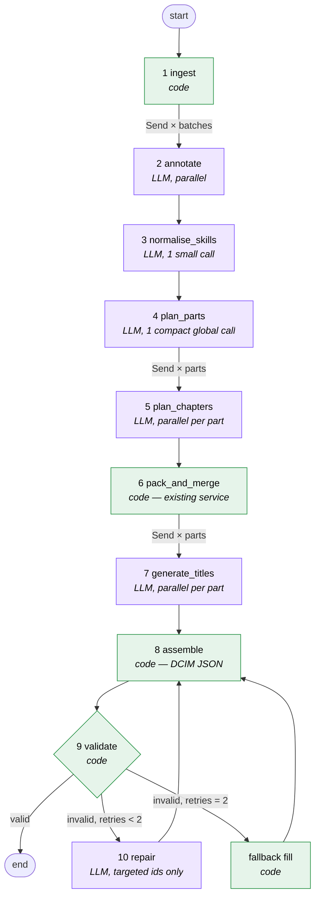
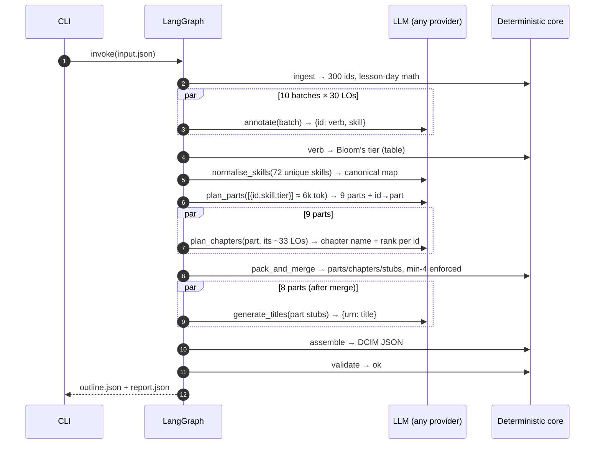

# Course Outline Generator — Scalable LangGraph MVP Design

> **Status:** DRAFT for review — no code written yet
> **Date:** 2026-08-27
> **Scope:** Rebuild the Berlin course-outline flow as a Python + LangGraph MVP that handles 10 → 100 → 300+ learning objectives (LOs) reliably, provider-agnostic (Anthropic / OpenAI / Bedrock).
> **Inputs reviewed:** `requirements.md`, `berlin-tool-node/*` (3 prompts, FastAPI pack-and-merge service, sample inputs 43/49/94/123, tool responses, llmlogs), `Implementation_Guide_Deterministic_Packing.md`, `DCIM_Course_Outline_Agent_System_Technical_Documentation.md`, `berlin-graph.png`.

---

## Table of Contents

1. [Executive Summary](#1-executive-summary)
2. [Diagnosis of the Current Graph](#2-diagnosis-of-the-current-graph)
3. [Answers to the Ten Architecture Questions](#3-answers-to-the-ten-architecture-questions)
4. [Target Architecture](#4-target-architecture)
5. [Step-by-Step Pipeline Walkthrough](#5-step-by-step-pipeline-walkthrough)
6. [State Design and Context Management](#6-state-design-and-context-management)
7. [Scaling Model: 10 → 100 → 300 LOs](#7-scaling-model-10--100--300-los)
8. [Validation, Repair and Retry](#8-validation-repair-and-retry)
9. [Provider-Agnostic LLM Layer](#9-provider-agnostic-llm-layer)
10. [Business Rules → Enforcement Owner Matrix](#10-business-rules--enforcement-owner-matrix)
11. [MVP Scope, Package Layout and Demo](#11-mvp-scope-package-layout-and-demo)
12. [Trade-offs and Alternatives Considered](#12-trade-offs-and-alternatives-considered)
13. [Risks and Open Questions](#13-risks-and-open-questions)
14. [Glossary](#14-glossary)

---

## 1. Executive Summary

The current Berlin graph already has the right *idea* — LLMs judge, Python counts — but the wrong *plumbing*. Two structural defects make it fail above ~50 LOs:

1. **The LLM is used as a data bus.** Every node re-types the entire payload it received (Analyser re-emits all LO text; Planner re-emits `annotated_objectives` into the tool call, then re-serialises the 70-chapter tool response into its handoff). Output tokens grow linearly with LO count at *every* hop. This is exactly what broke the 94-LO run: the Planner's post-tool forward emitted 2 parts / 9 chapters instead of 11 / 72, and the DCIM failure guard fired.
2. **The synthesizer regenerates the whole document.** The DCIM node emits the complete final JSON (13.6k output tokens for 43 LOs). At 300 LOs that is ~90k+ output tokens in a single generation — beyond practical limits for any provider and fragile long before that.

The redesign keeps the proven pieces (verb/skill/Bloom's extraction, skill-based grouping, the deterministic pack-and-merge algorithm, the DCIM JSON contract) and changes the plumbing:

- **LLMs emit only deltas keyed by short IDs** (`L17 → part P3, chapter C9`, `C9 → "Inference Rules"`), never full records. Output tokens become O(decisions), not O(payload).
- **Python owns the document.** A single assembler builds the final DCIM JSON from state; an LLM never writes the output file.
- **Map-reduce where work is per-item** (annotation, chapter planning, title generation) via LangGraph `Send` fan-out; **one compact global call** where a whole-course view is needed (part skeleton).
- **Validation + targeted repair** at every LLM boundary, with deterministic fallbacks so the pipeline always terminates with a valid outline.

Projected token footprint for 300 LOs: ~35k input / ~8k output *total across all calls*, no single call above ~8k input. Wall-clock dominated by ~6 sequential LLM rounds, each parallelised.

---

## 2. Diagnosis of the Current Graph

### 2.1 Current topology (from `berlin-graph.png`)

```
start → LearningObjectiveAnalyser ─┬→ SkillsBasedCurriculumProgressionPlanner ──┐
                                   ├→ ThemeBasedCurriculumProgressionPlanner ───┤
                                   ├→ StandardsDrivenCurriculumProgressionPlanner┼→ CourseOutlinePackAndMerge (REST tool)
                                   └→ ChronologicalCurriculumProgressionPlanner ─┘          │
                                                                                            ▼
                                            (planner re-invoked to forward tool result) → DCIMCourseOutlineGenerator → end
```

### 2.2 Measured token flow (from `llmlogs-*.json`)

| Run | Node | Prompt tokens | Completion tokens | Observation |
|---|---|---|---|---|
| 43 LOs | Analyser | 5,658 | 3,507 | Re-emits all 43 LO texts |
| 43 LOs | Planner (tool call) | 5,488 | 6,091 | Tool args include full `annotated_objectives` again |
| 43 LOs | Planner (forward) | 22,373 | 13,883 | Re-serialises tool response verbatim |
| 43 LOs | DCIM | 17,441 | 13,603 | Regenerates whole outline |
| 94 LOs | Analyser | 8,554 | 7,382 | |
| 94 LOs | Planner (tool call) | 9,159 | 12,765 | |
| 94 LOs | Planner (forward) | 43,708 | 11,965 | **Emitted 2 parts / 9 chapters of 11 / 72 → data loss** |
| 94 LOs | DCIM | 15,523 | 135 | Failure guard: `num_content_parts=11 … parts array contains only 2 parts` |

Total for 94 LOs: **~77k prompt + ~32k completion tokens**, and the run still failed. Extrapolated to 300 LOs the DCIM alone would need ~95k completion tokens.

### 2.3 Root causes

| # | Root cause | Symptom | Fix in redesign |
|---|---|---|---|
| R1 | LLM re-types payloads between nodes ("LLM as data bus") | Truncation / silent data loss at 94 LOs; 4× token cost | State holds data once; LLM outputs ID-keyed deltas only |
| R2 | Synthesizer emits the whole document | 13.6k output tokens @ 43 LOs; O(n) growth | Python assembler builds JSON; LLM only titles |
| R3 | Planner does two LLM turns (call tool, then forward) | Second turn has 44k-token prompt and must copy 72 chapters | Tool is a Python function call inside a node; no LLM forwarding turn |
| R4 | Every node sees full LO text | Prompt size O(n × LO length) | Nodes get *projections* (id + skill + Bloom's) unless they need text |
| R5 | No validation loop; DCIM "failure guard" is an LLM prompt | Failures surface as prose, not as structured retries | Code validators + conditional edges + targeted repair |
| R6 | Bloom's mapping done by LLM even though it is a verb→tier lookup table | Wasted tokens, non-determinism | Verb extraction by LLM, tier lookup by code |
| R7 | Berlin template variables stringify JSON (`"{{ grouping_plan }}"`) | Pydantic has to unwrap double-encoded JSON | Native Python objects in LangGraph state |

### 2.4 What is worth keeping

- The **three-role split** (analyse → plan → enforce → render) is correct.
- `course_outline_structure_service.py` — packing, `_enforce_minimum_4`, name merging, uniquifying, numbering, validation — is solid and becomes an in-process library call.
- The **DCIM output contract** (`label/type/children`, structural chapters, semester parts, `total_*`, pacing fields) as seen in `tool-response-43-lg-new.txt`.
- The **prompt content** for skill extraction, grouping heuristics and module-title rules (trimmed to remove transport/serialisation instructions).

---

## 3. Answers to the Ten Architecture Questions

### Q1. Is LangGraph the right architecture?

**Yes, for this workload — as a thin orchestration layer over plain Python nodes, not as an "agent" framework.**

What LangGraph gives you that a hand-rolled pipeline doesn't:

| Need | LangGraph feature |
|---|---|
| Fan-out N batches, fan-in results | `Send` API + state reducers (map-reduce) |
| Validation → repair → re-validate loops with bounded retries | Conditional edges + retry counter in state |
| Resume after a failed batch without redoing everything | Checkpointer (`MemorySaver` for MVP, Postgres/Redis later) |
| Streaming progress to a UI ("annotating batch 3/8") | `graph.stream()` events |
| Same mental model as Berlin | Berlin is LangGraph underneath — the MVP maps 1:1 to future Berlin nodes |

What to avoid: ReAct-style agents, tool-calling loops, LLM-driven routing. Every edge in this graph is decided by Python. The LLM never sees the graph.

**Alternative rejected:** plain `asyncio` pipeline. Simpler for a demo, but you would rebuild retries, checkpointing and fan-out by hand, and lose the Berlin alignment story.

### Q2. Batching / parallelisation and preserving global context

**Batch everything that is per-item; keep one small global call for course-level structure.**

| Stage | Needs global view? | Strategy |
|---|---|---|
| Annotate LOs (verb, skill) | No — each LO independent | Batches of ~30, parallel `Send` |
| Skill normalisation | Yes, but over *unique skills* (≪ LOs) | One call on the deduped skill list (~40–80 items) |
| Part skeleton (which skills form which parts, in what order) | Yes | One call on **compact projection**: `id, skill, tier` only. 300 LOs ≈ 6k tokens |
| Chapter assignment within a part | Only the part's LOs | Parallel `Send`, one per part (~15–40 LOs each) |
| Pack / merge / estimate | Yes | Python — no token cost |
| Module & chapter titles | Only the chapter's LOs | Parallel `Send`, one per part (returns ID→title map) |
| Assemble / validate | Yes | Python |

**How global context survives batching:** the global call produces a *skeleton* (`parts[]` with names, ordered skill lists, complexity). Every per-part call receives (a) the skeleton summary (~500 tokens), (b) only its own LOs. Per-batch outputs are keyed by IDs, so the reducer merges them without conflict. Nothing an LLM sees is ever larger than the skeleton + one part.

### Q3. LLM vs deterministic

| Responsibility | Owner | Why |
|---|---|---|
| Extract action verb + primary skill from LO text | **LLM** | Semantic |
| Bloom's tier from verb | **Code** (lookup table already in Analyser prompt) | Deterministic lookup |
| Normalise near-duplicate skills ("Evidence Analysis" vs "Analyzing Evidence") | **LLM** (small call on unique skill list) | Semantic |
| Group skills into parts, name parts, order parts | **LLM** | Pedagogical judgement |
| Assign LOs to chapters within a part, name chapters, order | **LLM** (per part) | Pedagogical judgement |
| Word / time estimates | **Code** | Rule table (grade band × tier) |
| Pack LOs into lesson-sized chapters | **Code** | Bin-packing |
| Merge undersized parts (min-4 rule + 2-part exception) | **Code** | Counting loop — proven LLM failure |
| Chapter/part/module numbering | **Code** | Arithmetic |
| Structural chapters (Overview, Intro, Apply, Review, Test, Semester A/B) | **Code** | Fixed template |
| Assessment placement (Quick Check per Understand, Unit Test, Semester Exam…) | **Code** | Fixed mapping table in `requirements.md` §3 |
| Module titles (2–5 word noun phrases) | **LLM** (per part, returns `{urn: title}`) | Creative |
| Pacing check, totals, `split_notes` | **Code** | Arithmetic |
| Final DCIM JSON | **Code** | Serialisation |
| Coverage / duplicate / order validation | **Code** | Set arithmetic |

Rule of thumb applied: *if you could write a unit test with an exact expected value, it's code.*

### Q4. Is Classifier → Planner → Synthesizer appropriate?

The **roles** are right; the **contract between them** is wrong. Three specific changes:

1. **Synthesizer becomes "Titler + Assembler".** The LLM's only output is `{urn: module_title, chapter_id: chapter_title}`. The assembler (code) produces the JSON. This removes the O(n) output problem entirely.
2. **Planner is split in two** (global skeleton, then per-part chapters) so that no single planning call scales with total LO count.
3. **Router collapses.** The four progression planners differ only in prompt text. One `plan_parts` node selects a prompt template by `course_outline_progression`. No LLM routing decision, no four graph nodes.

### Q5. Redesigned graph (conceptual)

See §4 for the full diagram. Shape:

```
ingest ─→ annotate (fan-out) ─→ normalise_skills ─→ plan_parts ─→ plan_chapters (fan-out)
      ─→ pack_and_merge ─→ generate_titles (fan-out) ─→ assemble ─→ validate ─┬→ END
                                                                             └→ repair ─┘
```

Same graph for 10, 100 and 300 LOs — only batch counts change. For ≤ 40 LOs the fan-outs degenerate to a single batch, which is fine. For 500 / 1,000 / 2,000+ LOs the planning stage switches tier (skill-level, then domain → parts) and the outline moves to an `OutlineStore` — see §7.1–7.3; no prompt anywhere grows with LO count.

### Q6. Preventing large intermediates from flowing through every node

- **Single source of truth in state:** `los: dict[str, LO]` keyed by short id. Written once at ingest, enriched in place (annotation fields), never copied.
- **Projections, not payloads:** each node builds its own prompt from a *view* of state (`[{id, skill, tier}]`), not from what the previous node "handed off".
- **ID-keyed deltas as LLM outputs:** LLMs return `{id: value}`; reducers merge into state.
- **No LLM ever receives the outline.** The outline is built once by `assemble` at the end.
- **Checkpointer stores state, not prompts.** Large `los` dict lives in the checkpoint; prompts are ephemeral.
- **Berlin compatibility:** if this later runs as Berlin nodes, the same discipline applies — pass ids, keep payloads in a store (Redis/S3) referenced by run id.

### Q7. Validation, merging, retry, repair

Three layers, all code:

1. **Schema validation** at every LLM boundary (Pydantic via structured output). Bad JSON → retry once with the parse error appended.
2. **Semantic validation** per stage — coverage (every id assigned exactly once), no invented ids, non-empty names, ranks are ints.
3. **Targeted repair** — never regenerate the whole stage. Examples: 12 LOs missing from planner output → one small call *"assign these 12 to existing parts"*; still missing after 2 attempts → deterministic fallback (attach to the part whose skill list contains the LO's skill; else the last part). Missing title → fallback title derived from `primary_skill` + verb.

Merging is unchanged: the existing `_enforce_minimum_4` runs after packing. It can never fail. Final `validate` re-checks the assembled outline (6 invariants) and only routes to `repair` for LLM-owned fields (titles); structural invariants are guaranteed by construction, so a structural failure is a bug, not a retry.

### Q8. Time estimation: LLM or deterministic?

**Deterministic.** The current service already does this (`_estimate_time_minutes`, `_estimate_word_count`) from `grade_band × blooms_level`. Keep it. If product later wants richer estimates, add inputs (e.g. LO text length bucket, assessment type) to the *table*, not an LLM call. Instructional Load Calculator from `requirements.md` §2 (`total_lesson_days = lessons_per_week × course_duration_weeks`, hours) is also pure arithmetic and lives in `ingest`.

### Q9. Provider-agnostic LLM layer

Use LangChain's chat-model abstraction, which already covers all three targets:

| Target | Class | Config string |
|---|---|---|
| Anthropic direct | `ChatAnthropic` | `anthropic:claude-sonnet-4-5` |
| OpenAI direct | `ChatOpenAI` | `openai:gpt-5.2` |
| Bedrock (Claude or other) | `ChatBedrockConverse` | `bedrock_converse:anthropic.claude-…` |
| Azure OpenAI (if needed) | `AzureChatOpenAI` | `azure_openai:<deployment>` |

Wrap it in one small internal interface (`LLMClient.structured(prompt, schema, *, role)`) so that:
- structured-output mode differences are hidden (tool-call JSON schema for Anthropic/OpenAI; JSON-mode + Pydantic parse fallback for Bedrock models that lack native structured output);
- retries / timeouts / token accounting are centralised;
- per-role model choice is config (`annotate: haiku-class`, `plan_parts: sonnet-class`).

Prompts are provider-neutral (no system-prompt-only tricks, no vendor-specific JSON-mode flags). Schemas are Pydantic models — the single contract. Token budgeting uses character counts (÷4), not vendor tokenisers.

### Q10. Recommended MVP

A single Python package (`outline/`) with a CLI:

```
python -m outline generate berlin-tool-node/sample-input-94-lg.json --provider anthropic --out out/94.json
```

that streams node progress, writes the DCIM JSON, a validation report and a token/latency report. Demo script: run 43 → 94 → 123 → synthetic 300 (concatenated samples with re-minted URNs) back-to-back, show identical structure guarantees and near-flat per-call token sizes. Reuse the existing pack-and-merge code as a library. No REST, no Berlin, no database.

---

## 4. Target Architecture

### 4.1 Layered view

```
┌─────────────────────────────────────────────────────────────────────────────┐
│  CLI / (later) FastAPI / (later) Berlin node adapters                        │
├─────────────────────────────────────────────────────────────────────────────┤
│  LangGraph StateGraph  (orchestration only: edges, fan-out, retries, ckpt)   │
│                                                                               │
│   ingest → annotate* → normalise_skills → plan_parts → plan_chapters*         │
│         → pack_and_merge → generate_titles* → assemble → validate ⇄ repair    │
│                                        (* = Send fan-out, parallel batches)   │
├──────────────────────────────┬──────────────────────────────────────────────┤
│  LLM nodes (thin)            │  Deterministic core (pure Python, unit-tested)│
│  - prompts/*.md templates    │  - rules/estimates.py   (word/time tables)    │
│  - schemas.py (Pydantic)     │  - rules/packing.py     (bin-pack)            │
│  - llm/client.py (provider   │  - rules/merging.py     (min-4 + exception)   │
│    -agnostic wrapper)        │  - rules/blooms.py      (verb → tier)         │
│                              │  - assemble/dcim.py     (JSON builder)        │
│                              │  - assemble/assessments.py (placement table)  │
│                              │  - validate/invariants.py                     │
├──────────────────────────────┴──────────────────────────────────────────────┤
│  State (TypedDict + reducers) — single copy of LO data, ID-keyed             │
└─────────────────────────────────────────────────────────────────────────────┘
```

### 4.2 Graph — ASCII

```
                              ┌──────────────┐
                              │   __start__  │
                              └──────┬───────┘
                                     ▼
                     ┌───────────────────────────────┐
                     │ 1. ingest              [code] │  validate input, mint ids L1..Ln,
                     │                               │  lesson-day math, grade-band norm
                     └───────────────┬───────────────┘
                                     │  Send × ⌈n/30⌉
              ┌──────────────────────┼──────────────────────┐
              ▼                      ▼                      ▼
   ┌────────────────────┐ ┌────────────────────┐ ┌────────────────────┐
   │ 2. annotate  [LLM] │ │ 2. annotate  [LLM] │ │ 2. annotate  [LLM] │  verb + skill per LO
   │    batch 1         │ │    batch 2         │ │    batch k         │  → {id: {verb, skill}}
   └─────────┬──────────┘ └─────────┬──────────┘ └─────────┬──────────┘
             └──────────────────────┼──────────────────────┘
                                    ▼  (reducer merges; code maps verb→Bloom's tier)
                     ┌───────────────────────────────┐
                     │ 3. normalise_skills     [LLM] │  unique skills (~40–80) → canonical
                     │    (single small call)        │  skill map; code applies it
                     └───────────────┬───────────────┘
                                     ▼
                     ┌───────────────────────────────┐
                     │ 4. plan_parts           [LLM] │  input: [{id, skill, tier}] compact
                     │    (single global call)       │  output: parts[{name, skills[], order}]
                     │    prompt by progression type │  + {id: part_id}
                     └───────────────┬───────────────┘
                                     │  Send × parts
              ┌──────────────────────┼──────────────────────┐
              ▼                      ▼                      ▼
   ┌────────────────────┐ ┌────────────────────┐ ┌────────────────────┐
   │ 5. plan_chapters   │ │ 5. plan_chapters   │ │ 5. plan_chapters   │  per part: chapter
   │    part P1   [LLM] │ │    part P2   [LLM] │ │    part Pm   [LLM] │  name + rank per id
   └─────────┬──────────┘ └─────────┬──────────┘ └─────────┬──────────┘
             └──────────────────────┼──────────────────────┘
                                    ▼
                     ┌───────────────────────────────┐
                     │ 6. pack_and_merge      [code] │  estimates, bin-pack, min-4 merge,
                     │    (existing service logic)   │  uniquify, number, coverage check
                     └───────────────┬───────────────┘
                                     │  Send × parts
              ┌──────────────────────┼──────────────────────┐
              ▼                      ▼                      ▼
   ┌────────────────────┐ ┌────────────────────┐ ┌────────────────────┐
   │ 7. generate_titles │ │ 7. generate_titles │ │ 7. generate_titles │  per part:
   │    part P1   [LLM] │ │    part P2   [LLM] │ │    part Pm   [LLM] │  {urn: module_title}
   └─────────┬──────────┘ └─────────┬──────────┘ └─────────┬──────────┘
             └──────────────────────┼──────────────────────┘
                                    ▼
                     ┌───────────────────────────────┐
                     │ 8. assemble            [code] │  DCIM JSON: overview part, intro/
                     │                               │  understand/apply/review/test,
                     │                               │  semester A/B, assessments, totals
                     └───────────────┬───────────────┘
                                     ▼
                     ┌───────────────────────────────┐
                     │ 9. validate            [code] │  6 invariants + schema
                     └───────┬───────────────┬───────┘
                       valid │               │ invalid & retries < 2
                             ▼               ▼
                      ┌───────────┐  ┌───────────────────────┐
                      │  __end__  │  │ 10. repair      [LLM] │ targeted: only failing ids
                      └───────────┘  └───────────┬───────────┘
                                                 └──────► back to 8. assemble
```

### 4.3 Graph — Mermaid



### 4.4 Sequence — one 300-LO run



---

## 5. Step-by-Step Pipeline Walkthrough

Each step lists: purpose, owner, input projection, output, size behaviour, failure handling.

### Step 1 — `ingest` (code)

- **Purpose:** turn the raw request into canonical state.
- **Does:** Pydantic-validate input; mint short ids (`L1…Ln`) mapped to URNs; detect duplicate URNs (keep rows, record duplicates); normalise `grade_band` (`_normalize_grade_band`); compute `total_lesson_days = lessons_per_week × course_duration_weeks`, `total_course_hours`, `chapter_word_count_limit` from `GRADE_WORD_LIMITS`; choose progression prompt template; compute batch plan.
- **Output to state:** `los`, `course`, `budget`, `batches`.
- **Size:** O(n) memory, zero tokens.
- **Failure:** input errors → terminate with structured error (no LLM call made).

### Step 2 — `annotate` (LLM, fan-out)

- **Purpose:** verb + primary skill per LO.
- **Prompt input:** `[{id, text}]` for ≤ 30 LOs (~1.2k tokens) + trimmed Analyser prompt (~800 tokens; verb tables removed — Bloom's mapping is now code).
- **Schema out:** `list[{id, verb, primary_skill}]`.
- **Post-processing (code):** `blooms_level = BLOOMS_TABLE.get(verb.lower(), "Foundational")` using the lowest-tier rule from the existing prompt. Reducer merges into `los[id]`.
- **Validation:** every batch id present exactly once; unknown id → drop; missing ids → re-ask *just those ids* once; still missing → `verb = first token`, `skill = first noun-ish 3 words`, flag `annotated_by_fallback`.
- **Size:** constant per batch. 300 LOs = 10 parallel calls.
- **Model tier:** small/fast (Haiku-class) is sufficient.

### Step 3 — `normalise_skills` (LLM, single)

- **Purpose:** collapse near-duplicate skill names so grouping is clean ("Rules Of Inference" / "Inference Rules").
- **Prompt input:** sorted unique skills with counts (~60 items ≈ 600 tokens).
- **Schema out:** `list[{raw, canonical}]`. Code applies map; unknown raw → identity.
- **Size:** grows with unique skills, not LOs — sub-linear. Skip node if ≤ 8 unique skills.

### Step 4 — `plan_parts` (LLM, single, compact)

- **Purpose:** course-level skeleton. This is the only place a single call sees every LO — deliberately in the cheapest possible form.
- **Prompt input:** course metadata + `[{id, skill, tier}]` (≈ 20 tokens/LO → 300 LOs ≈ 6k tokens) + progression-specific instructions (skills-based / theme / chronological / standards-driven — the only thing that varies) + `user_prompt` if present.
- **Schema out:**
  ```json
  { "parts": [ {"part_id": "P1", "part_name": "Logic and Proof", "order": 1,
                "part_domain_complexity": "Intermediate", "lo_ids": ["L1","L4",…]} ],
    "planning_notes": "…" }
  ```
  Part names ≤ 6 words, noun phrases; target 4–8 chapter groups per part (guidance only — merge is downstream).
- **Validation:** every id in exactly one part; no invented ids; ≥ 1 part. Missing ids → targeted repair call ("place these ids into one of these parts"); after 2 attempts → deterministic fallback by canonical skill match, else last part.
- **Size:** input linear but tiny (6k @ 300); output ≈ 3 tokens/id ≈ 1k. For > 600 LOs, switch to *skill-level* planning (assign skills to parts, then expand to ids in code) — same schema, input becomes O(unique skills).

### Step 5 — `plan_chapters` (LLM, fan-out per part)

- **Purpose:** within one part, group LOs into chapter groups, name them, order them Foundational → Intermediate → Advanced with prerequisite sense.
- **Prompt input:** skeleton summary (all part names, ~300 tokens) + this part's LOs with full text (`[{id, text, skill, tier}]`, ~40 tokens/LO → 40 LOs ≈ 1.6k).
- **Schema out:** `list[{id, chapter_name, order_rank}]` — exactly the existing `GroupingAssignment` minus `part_name` (implied).
- **Validation:** coverage within the part; targeted repair; fallback = one chapter per canonical skill, rank by tier then input order.
- **Size:** bounded by part size (~15–45 LOs), independent of total n.

### Step 6 — `pack_and_merge` (code)

- **Purpose:** the existing service, in-process.
- **Does:** build `GroupingPlan` from state → `_build_initial_parts` (estimates, bin-pack by word/time/density) → `_enforce_minimum_4` (with 2-part exception) → `_uniquify_chapter_names` → `_number_parts` → `_validate_output`. Emits `parts`, `enforcement_log`, `validation`, counts.
- **Change from today:** input/outputs are Python objects, no Pydantic string-unwrapping, no HTTP. Keep the module importable so the FastAPI service and the graph share one implementation.
- **Failure:** cannot fail on rules; `validation.valid == False` here indicates an upstream id bug → hard stop with diagnostics (a real bug, not a retry case).

### Step 7 — `generate_titles` (LLM, fan-out per part)

- **Purpose:** the only creative output of the old DCIM node.
- **Prompt input:** per part: chapter list with stubs `[{urn_short_id, lo_text, skill, tier, chapter_name}]` (~45 tokens/LO). Title rules from the current DCIM prompt (2–5 word noun phrase, distinct within chapter, no "Part 2", no generic labels, not equal to chapter title).
- **Schema out:** `{ "modules": [{id, title}], "chapters": [{chapter_id, title}] }` (chapter titles optional — default to the packed `chapter_name`; ask the LLM only to *improve* names produced by merging, e.g. `"X and Related Concepts"`).
- **Validation:** all stub ids titled; distinctness within chapter (code); banned patterns (regex). Repair: re-ask for failing ids only; fallback title = `f"{skill}: {verb.title()}"`.
- **Size:** bounded per part; output ≈ 10 tokens/LO.

### Step 8 — `assemble` (code)

- **Purpose:** build the final DCIM document exactly matching the contract in `tool-response-43-lg-new.txt`.
- **Does:** Part 1 Overview (course_guide, overview_introduction) → for each content part: Introduction chapter, understand chapters (module per stub: label/type/module_number/title/urn/estimates/skill/tier), Apply, Review, Part Test → Semester A / B (review + exam) → totals (`total_parts = 1 + parts + 2`, `total_chapters = 1 + content + 4·parts + 4`) → pacing (`±5 %` tolerance, `pacing_overrun*`, `split_notes`) → `unassigned_objective_urns` (always `[]` by construction) → **assessment placement** per `requirements.md` §3 (Quick Check on Understand chapters, Sample Work on Apply, Unit Online Practice on Review, Unit Test on Test, Semester Online Practice / Exam on semester chapters; Portfolio modules *not* in MVP).
- **Size:** O(n) memory, zero tokens.

### Step 9 — `validate` (code)

Invariants (from the Implementation Guide, plus two):

1. Every input URN appears exactly once as `learning_objective_urn` (duplicate input rows honoured by count).
2. Every content part has ≥ 4 understand chapters, or the 2-part exception is logged.
3. Semester A and B parts exist; Part 1 is overview.
4. Module order within each chapter equals stub order; chapter order equals packed order.
5. `chapter_estimated_*` equals the sum of its modules; totals fields match counts.
6. All module titles present, distinct within chapter, not matching banned patterns.
7. Output validates against the DCIM Pydantic schema.

Routing: pass → END. Fail on 6 → `repair`. Fail on 1–5, 7 → hard error (construction bug; never retry an LLM for it).

### Step 10 — `repair` (LLM, targeted)

- Receives only the failing items (e.g. 3 duplicate titles in chapter C12) and the local context. Returns replacements. Max 2 rounds, then code fallback. Increments `repair_attempts` in state.

---

## 6. State Design and Context Management

### 6.1 State schema (conceptual)

```python
class LO(TypedDict):
    id: str                 # "L17"  — short id used in every prompt
    urn: str                # real URN — only code sees it
    text: str
    verb: str | None
    primary_skill: str | None      # canonical after normalise_skills
    raw_skill: str | None
    blooms_level: str | None
    part_id: str | None
    chapter_name: str | None
    order_rank: int | None
    module_title: str | None
    flags: list[str]        # e.g. ["annotated_by_fallback"]

class OutlineState(TypedDict):
    course: CourseMeta                     # title, band, subject, minutes, weeks, progression, user_prompt
    budget: Budget                         # total_lesson_days, word_limit, hours
    los: Annotated[dict[str, LO], merge_by_id]      # reducer: dict-merge per id
    skill_map: dict[str, str]
    parts_plan: list[PartPlan]             # skeleton from plan_parts
    packed: PackMergeResult | None         # output of step 6 (parts/stubs/log/validation)
    titles: Annotated[dict[str, str], merge]        # id → title
    outline: dict | None                   # final DCIM JSON
    validation: ValidationReport | None
    repair_attempts: int
    metrics: Annotated[list[CallMetric], add]       # tokens/latency per LLM call
```

### 6.2 Rules that keep context small

| Rule | Effect |
|---|---|
| Short ids in prompts, URNs only in code | ~45 chars/URN × 300 = 13.5k chars saved per prompt; no byte-for-byte URN copying risk |
| Node builds its own projection from `los` | No node inherits another node's payload |
| LLM output = delta keyed by id | Output tokens ∝ decisions |
| Reducers merge fan-out results | No node ever holds all batches' prompts |
| `outline` written once by `assemble` | No LLM ever sees or emits the document |
| Prompts ≤ ~8k tokens by construction | Batch sizes are chosen from a `max_prompt_chars` budget at ingest, not fixed constants |

### 6.3 Regeneration hooks (not MVP, but the design supports them)

Because everything is id-keyed, `requirements.md` §4 regeneration maps cleanly: *regenerate unit P3* = re-run `plan_chapters(P3)` → `pack_and_merge` → `generate_titles(P3)` → `assemble`. Undo = restore previous checkpoint. Manual edits = state patches followed by `assemble` + `validate`.

---

## 7. Scaling Model: 10 → 100 → 300 LOs

Assumptions: ~40 tokens per LO text; batch size 30; parts ≈ n/35.

| Stage | 10 LOs | 100 LOs | 300 LOs | Largest single prompt |
|---|---|---|---|---|
| annotate | 1 call | 4 calls ∥ | 10 calls ∥ | ~2k |
| normalise_skills | skip | 1 call (~40 skills) | 1 call (~70 skills) | ~1k |
| plan_parts | 1 call (~0.4k in) | 1 call (~2.2k in) | 1 call (~6.5k in) | ~7k |
| plan_chapters | 1 call | 3 calls ∥ | 9 calls ∥ | ~3k |
| pack_and_merge | code | code | code | 0 |
| generate_titles | 1 call | 3 calls ∥ | 8 calls ∥ | ~3k |
| assemble + validate | code | code | code | 0 |
| **Total tokens (in / out)** | ~4k / 0.6k | ~15k / 3k | ~38k / 8k | — |
| **Sequential LLM rounds** | 4 | 5 | 5 | — |
| **Est. wall-clock** | ~20 s | ~45 s | ~70 s | — |

Compare today: 94 LOs = 77k / 32k tokens, 4 strictly sequential calls, and failed.

### 7.1 Scaling tiers — 500, 1,000, 2,000+ LOs (design requirement: *any* input size)

The graph is the same at every size; only the **planning tier** and the **output handling** change, both selected automatically in `ingest` from `n_los` and the character budget.

```
 n_los        planning tier                         global context carrier
 ─────────    ───────────────────────────────────   ─────────────────────────────────
 ≤ 300        T0  one compact call over LO ids       skeleton (part names + order)
 300–1,000    T1  skill-level: unique skills → parts  Course Context Card + name registry
              (LOs expanded to parts by code)
 1,000+       T2  hierarchical: skills → domains      Course Context Card + domain map
              → parts per domain (∥), semesters       + name registry
              assigned by code from lesson-day budget
```

**Tier T1 — skill-level planning (300–1,000 LOs).** After `normalise_skills`, the unique canonical skill list is typically 5–15 % of `n_los` (e.g. 1,000 LOs → ~120 skills). `plan_parts` receives `skill | lo_count | tier_mix | 2 example objectives` (~35 tokens per skill → ~4k tokens) and returns parts as ordered skill lists. Code expands each skill to its LO ids. Rarely a skill is too large for one part (> 40 LOs) — code splits it by Bloom's tier into "Skill — Foundations" / "Skill — Applications" before planning. Result: `plan_parts` input is O(unique skills), never O(LOs).

**Tier T2 — hierarchical planning (1,000+ LOs).**
1. `plan_domains` [LLM, one call over the skill list, ~4–8k tokens]: cluster skills into 6–14 ordered *domains* (e.g. "Number Sense", "Algebraic Thinking") and assign each domain to Semester A or B by cumulative estimated lesson days (code computes the estimate; LLM only orders).
2. `plan_parts` fans out **per domain** (∥): each call sees the Course Context Card + only its domain's skills (~20–40) → parts for that domain.
3. Everything downstream is unchanged and already per-part.

Depth is bounded: at 5,000 LOs → ~500 skills → ~14 domains × ~35 skills — every prompt still ≤ 8k tokens. No prompt anywhere in the system grows with `n_los`.

**Course Context Card (CCC)** — how *global context* survives fan-out at any size. A ~400-token block built by code and prepended to *every* per-domain / per-part / per-title call:

```
COURSE: {title} | {grade_band} | {subject} | progression={type}
CALENDAR: {lessons_per_week}×{weeks} = {total_lesson_days} lesson days, {minutes}/day, word limit {limit}
STRUCTURE SO FAR: Semester A: P1 "…", P2 "…" … | Semester B: P7 "…" …   (names only)
THIS UNIT: P4 "Proportional Reasoning" — domain "Ratios & Rates" — unit 4 of 11
NAMING: Title Case noun phrases; do not reuse: [registry of part + chapter names already used]
USER GUIDANCE: {user_prompt or "none"}
```

The **name registry** is the cross-part consistency mechanism: code collects every part/chapter/module title as batches return; later batches receive the registry as "do not reuse"; code enforces global uniqueness afterwards (suffix with skill differentiator, never "Part 2"). An optional final `naming_review` [LLM, one call over the list of *names only* — 1,000 chapters ≈ 8k tokens] can polish inconsistent naming style; it returns `{id: new_name}` deltas, so it stays bounded.

**Semester boundary at scale** is code: cumulative lesson days across ordered parts; the boundary falls after the part that crosses `total_lesson_days / 2` (± one part to avoid splitting a domain). Semester A/B review + exam parts are inserted by `assemble`.

### 7.2 Large *output* management (500 LOs ≈ 1,000+ chapters, multi-MB JSON)

The output problem is solved by never generating it with an LLM, but a 500–2,000-LO outline is still large for transport, checkpointing and UIs:

| Concern | Design |
|---|---|
| Building it | `assemble` streams part-by-part into a JSON writer (no giant in-memory string), then validates from the same structure |
| Storing it | `outline` is **not** kept in graph state above a size threshold (default 1 MB); state stores `outline_ref` (path / S3 key / DB row). Checkpoints stay small |
| Returning it | CLI writes `outline.json`; API returns `outline_url` + paginated `GET /outline/{run}/parts/{n}` for UIs; optional NDJSON stream of parts for progressive rendering |
| Excel export (`requirements.md` §5) | Generated by code from the same structure — one row per module, streamed with `openpyxl` write-only mode |
| Validation cost | All invariants are single-pass O(n); 2,000 LOs validates in < 1 s |
| Regeneration of one unit | Re-run per-part nodes for that `part_id` and re-assemble only that part into the stored document (id-keyed patch), not the whole course |

### 7.3 Token and latency projection with tiers

| n_los | Tier | Unique skills | LLM calls | Max prompt | Total in / out | Sequential rounds | Est. wall-clock (concurrency 8) |
|---|---|---|---|---|---|---|---|
| 300 | T0 | ~70 | ~30 | ~7k | 38k / 8k | 5 | ~70 s |
| 500 | T1 | ~100 | ~48 | ~5k | 60k / 13k | 5 | ~90 s |
| 1,000 | T1 | ~150 | ~95 | ~6k | 115k / 26k | 5 | ~2.5 min |
| 2,000 | T2 | ~260 | ~190 | ~8k | 230k / 52k | 6 | ~4.5 min |

Costs grow linearly with LOs; *risk* does not — the largest single prompt is flat, and every structural guarantee is code.

---

## 8. Validation, Repair and Retry

### 8.1 Policy table

| Boundary | Check (code) | On failure | Max attempts | Fallback (code) |
|---|---|---|---|---|
| Any LLM call | JSON parses, matches Pydantic schema | Re-call with error message appended | 1 | Treat as empty result → semantic repair below |
| annotate batch | all ids present once | Re-ask missing ids only | 1 | verb = first word, skill = first 3 content words |
| normalise_skills | mapping keys ⊆ raw skills | Drop unknown keys | 0 | identity |
| plan_parts | all ids once; ≥ 1 part; names valid | Re-ask missing/duplicate ids with part list | 2 | assign by skill match → last part |
| plan_chapters(part) | part ids once; names valid | Re-ask missing ids | 2 | one chapter per skill, rank by tier |
| pack_and_merge | `validation.valid` | **Hard stop** (bug) | — | — |
| generate_titles(part) | all ids titled; distinct; not banned | Re-ask failing ids | 2 | `"{Skill}: {Verb}"` |
| validate (final) | 7 invariants | invariant 6 → repair; others → hard stop | 2 | fallback titles |

### 8.2 Design principles

- **Repair is always narrower than the original call.** Cost of a retry is proportional to the defect, not the stage.
- **Every LLM stage has a deterministic fallback** so the graph always terminates with a *valid* outline; fallbacks are flagged in `report.json` so quality regressions are visible.
- **Structural rules are unfalsifiable by construction** — they're produced by code, so a violation is a test failure, not a runtime retry.
- **Transient provider errors** (429/5xx/timeouts) are handled inside `LLMClient` with exponential backoff (3 tries), independent of semantic retries.
- **Idempotent nodes + checkpointer** mean a crashed run resumes at the failed node with the same `thread_id`.

---

## 9. Provider-Agnostic LLM Layer

### 9.1 Interface

```python
class LLMClient(Protocol):
    async def structured(self, *, role: str, system: str, user: str,
                         schema: type[BaseModel]) -> tuple[BaseModel, CallMetric]: ...
```

- `role` selects the model from config (`annotate`, `plan_parts`, `plan_chapters`, `titles`, `repair`).
- Implementation uses `langchain.chat_models.init_chat_model("<provider>:<model>")` and `.with_structured_output(schema, method=...)`, choosing the method per provider capability; Bedrock models without native structured output fall back to "JSON in text" + Pydantic parse + one corrective retry.
- Returns `CallMetric` (provider, model, prompt/completion tokens, latency, attempt) for the report.

### 9.2 Config (`config.yaml`)

```yaml
provider: anthropic          # anthropic | openai | bedrock
models:
  default:       claude-sonnet-4-5
  annotate:      claude-haiku-4-5
  plan_parts:    claude-sonnet-4-5
bedrock:
  region: us-east-1
  model_ids:
    claude-sonnet-4-5: anthropic.claude-sonnet-4-5-…-v1:0
batching:
  annotate_batch_size: 30
  max_prompt_chars: 32000
retries: {schema: 1, semantic: 2, transport: 3}
```

Switching provider = one CLI flag. Prompts and schemas never change.

### 9.3 Portability rules for prompts

- Plain system + user messages; no vendor-specific "JSON mode" language.
- Structured output enforced by schema, not by prose ("Return only JSON") — prose remains as a hint only.
- No reliance on ordering guarantees inside LLM output; code sorts by `order_rank`, then input order.
- Token budgets computed by characters (÷ 4) with 25 % headroom.

---

## 10. Business Rules → Enforcement Owner Matrix

| Rule (source) | Owner | Node |
|---|---|---|
| 1 LG ↔ 1 Module (`requirements.md` §1, STUDIOPE-6) | code | assemble + validate |
| Hierarchy Course → Unit(part) → Lesson(chapter) → Module (§1) | code | assemble |
| ≥ 4 Understand lessons per unit; merge adjacent if fewer; 2-part exception (STUDIOPE-301) | code | pack_and_merge |
| Max 4 LOs per chapter; chapter ≤ word limit & ≤ minutes/day | code | pack_and_merge |
| Word & time estimates by grade band × Bloom's | code | pack_and_merge |
| Progression type (skills / theme / chronological / standards) (§2) | LLM prompt variant | plan_parts, plan_chapters |
| DCIM in-unit flow Introduce → Understand → Apply → Reflect/Review → Evaluate/Test (§2) | code | assemble |
| Instructional load: lesson days, hours, pacing ±5 % (§2) | code | ingest, assemble |
| Effort ratings 1–5 (§2) | captured, passed through (no behaviour in MVP) | ingest |
| Default assessment per lesson type (§3) | code | assemble |
| Semester A/B review + exam parts | code | assemble |
| Unique, non-generic chapter & part names | LLM + code uniquify + regex validation | plan_*, pack_and_merge, validate |
| Module titles 2–5 words, distinct, no banned suffixes | LLM + code validation | generate_titles, validate |
| Exact URN & course-title copying | code (LLM never handles URNs) | assemble |
| `user_prompt` overrides grouping/naming preferences but not integrity | LLM prompt + code invariants | plan_*, validate |
| Regeneration / undo / drag-drop / Excel export / graph view / content reuse (§4–6) | **out of MVP scope** — design supports via id-keyed state | — |

---

## 11. MVP Scope, Package Layout and Demo

### 11.1 In scope

- CLI generation for one course from the existing sample-input JSON format.
- All four progression types via prompt templates (skills-based fully tested; others smoke-tested).
- Providers: Anthropic direct (primary, you have access), OpenAI direct, Bedrock — configured, with a stub/mocked LLM for unit tests.
- Output: DCIM JSON identical in shape to `tool-response-43-lg-new.txt` + `report.json` (validation, enforcement log, per-call tokens/latency, fallbacks used).
- Test inputs: 43, 49, 94, 123 (existing) + synthetic 300 (concatenated with re-minted URNs).
- Unit tests for every deterministic module; graph test with mocked LLM; one live smoke test.

### 11.2 Out of scope

REST API, Berlin registration, persistence beyond in-memory checkpoint, UI, regeneration/undo, Excel export, standards graph view, content reuse across states, Portfolio modules.

### 11.3 Package layout

```
outline/
  __main__.py            # CLI: generate / report
  config.py              # yaml + env loading
  state.py               # TypedDicts + reducers
  schemas.py             # Pydantic: input, LLM outputs, DCIM output
  graph.py               # build_graph(): nodes, Send fan-outs, edges
  nodes/
    ingest.py  annotate.py  normalise_skills.py  plan_parts.py
    plan_chapters.py  pack_and_merge.py  generate_titles.py
    assemble.py  validate.py  repair.py
  rules/
    blooms.py  estimates.py  packing.py  merging.py  naming.py   # from existing service
  assemble/
    dcim.py  assessments.py  pacing.py
  llm/
    client.py  providers.py  budget.py
  prompts/
    annotate.md  normalise_skills.md  plan_parts_{skills,theme,chrono,standards}.md
    plan_chapters.md  titles.md  repair.md
tests/
  unit/ (rules, assemble, validate)   graph/ (mocked LLM end-to-end)   fixtures/
```

### 11.4 Demo script (what the team sees)

1. `outline generate sample-input-43-lg.json` → streamed node progress, valid outline, report shows ~10 calls, max prompt ~3k.
2. Same for `94` (the one that fails today) → succeeds; show `enforcement_log` merges.
3. `synthetic-300.json` → succeeds; show per-call token table is flat, total < 50k.
4. `--provider openai` on the 43 case → same structure, different titles → provider-agnostic proven.
5. Open `report.json`: zero fallbacks used, all invariants green.

---

## 12. Trade-offs and Alternatives Considered

| Decision | Chosen | Alternative | Why |
|---|---|---|---|
| Orchestration | LangGraph (thin) | asyncio pipeline | Fan-out, retries, checkpoint, Berlin parity for free; cost is a small learning curve |
| Global planning input | Compact `{id, skill, tier}` list in one call | Hierarchical (batches → merge plans) | One call keeps global coherence; 6k tokens @ 300 is cheap; hierarchical only needed > 600 |
| Synthesizer | Code assembler + LLM titles | Keep LLM synthesizer with chunked output | Chunked JSON generation still risks structural drift; assembler makes structure unfalsifiable |
| Bloom's | Code lookup | LLM classification | Table already exists; deterministic; saves ~30 % of annotate output |
| Router | Prompt template switch | Four planner nodes | Identical logic; fewer nodes; no LLM routing |
| Pack-and-merge | In-process import of existing service | Keep REST call | Removes HTTP/serialisation failure class; same code can still serve FastAPI |
| Ids in prompts | Short ids | URNs | Smaller prompts, no URN corruption risk |
| Structured output | Provider-native tool/JSON schema via LangChain | Prose + regex | Fewer parse failures; portable |
| Repair | Targeted per-id | Full stage regeneration | Cost ∝ defect; avoids re-introducing new defects |

---

## 13. Risks and Open Questions

| Risk / question | Mitigation / decision needed |
|---|---|
| Theme / chronological / standards prompts are not in the repo (only skills-based) | Write from Implementation Guide + requirements; skills-based is the demo path. **Need:** existing prompt text if available. |
| `plan_parts` quality with compact projection (no LO text) | Include canonical skill + tier + first 6 words of text if quality suffers (adds ~8 tok/LO). Measure on 94/123. |
| Bedrock structured-output support varies by model | Client falls back to JSON-in-text + Pydantic + one corrective retry. |
| Assessment placement fields are not in today's DCIM output | Add as optional `assessment` field on chapters; keep old shape valid. **Confirm** desired field name/shape. |
| Synthetic 300-LO input is not pedagogically realistic | Fine for scale/reliability demo; flag in demo narrative. |
| Rate limits with 10 parallel calls | `max_concurrency` config (default 5); LangGraph honours it. |
| `user_prompt` regeneration feedback semantics | MVP passes it to `plan_parts` / `plan_chapters` only. |

---

## 14. Glossary

| Term | Meaning |
|---|---|
| LO / LG | Learning objective / learning goal — one input row with a URN |
| Part / Unit | Top-level content container (DCIM `part`, PVS "Unit") |
| Chapter / Lesson | One lesson day (DCIM `chapter`, PVS "Lesson") |
| Module | One LO's content page; 1:1 with LO (PVS "Module"/"Slate" parent) |
| Understand chapter | Content chapter holding LO modules (vs. structural Intro/Apply/Review/Test) |
| DCIM | Dynamic Classroom Instructional Model — Introduce → Understand → Apply → Reflect → Evaluate |
| Skeleton | `plan_parts` output: ordered parts with names and member LO ids |
| Stub | Pre-populated module record from pack-and-merge with `module_title = null` |
| Projection | The minimal view of state a node puts into a prompt |
| Delta | ID-keyed LLM output merged into state by a reducer |
